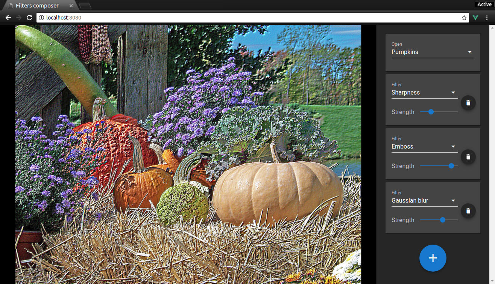

# filters-composer

Demo: reactive picture editing with filters. Works [right in your browser](https://quasiyoke.github.io/filters-composer/). Powered by WebGL, Vue, Vuex and Vuetify.

[](https://quasiyoke.github.io/filters-composer/)

## Installation

```sh
npm install
```
